## Was ist ein Neuron?

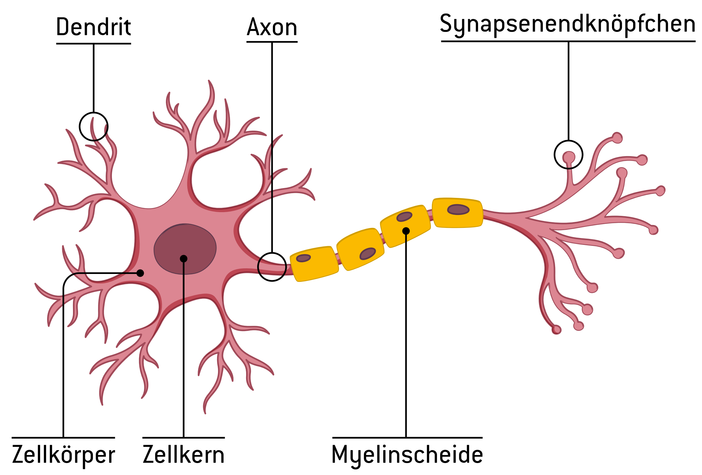

------------------------------------------------------------------------

### Viele Neuronen

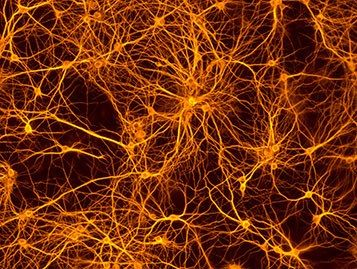

------------------------------------------------------------------------

### Vereinfachtes Neuron

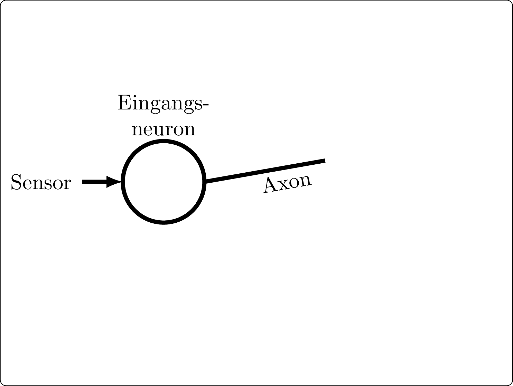

------------------------------------------------------------------------

### Einfachstes Perzeptron

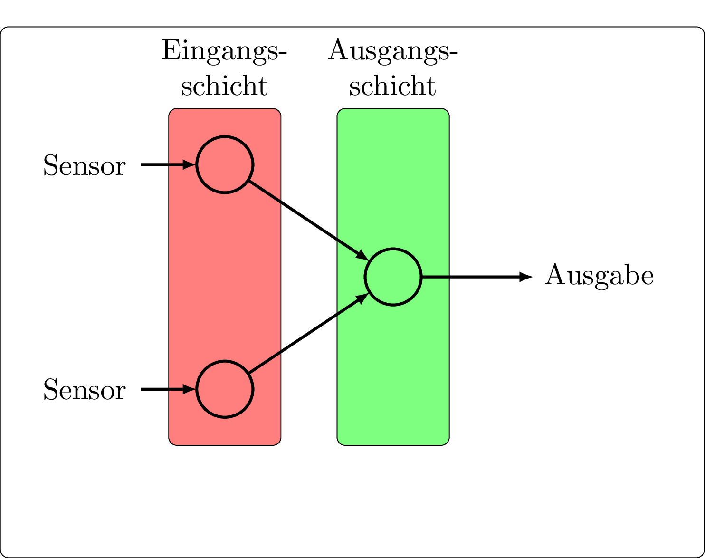

------------------------------------------------------------------------

### Werte und Gewichte

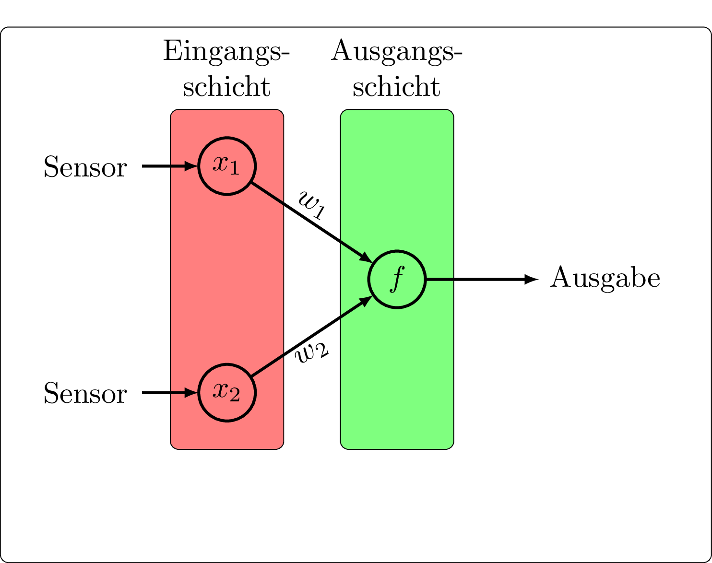

### Aktivierungsfunktion

Das Neuron *feuert* abhängig vom Funktionswert

$$x_1 \cdot w_1 + x_2 \cdot w_1 \geq \theta \qquad \Rightarrow \qquad \text{Ausgabe 1 oder 0}$$

---

## Umsetzung

``` python
import matplotlib.pyplot as plt
from random import random

w1 = 3       # Nur Beispielwerte
w2 = -2
s = 10

x1 = float(input("x1 eingeben: "))
x2 = float(input("x2 eingeben: "))

if w1*x1+w2*x2 >= s:
  plt.scatter(x1,x2, color="green")
else:
  plt.scatter(x1,x2, color="red")

plt.show()
```

---

## Verbesserte Version

``` python
import matplotlib.pyplot as plt
from random import random

w1 = 3
w2 = -2
s = 0.5

def entscheidung(x1, x2):
    if w1 * x1 + w2 * x2 > s:
        return "red"
    return "green"
```

---

## Verbesserte Version

``` python
x = []
y = []
farben = []
```

---

## Verbesserte Version

``` python
for i in range(1000):
    x1 = random()  # Zahlen zwischen 0 und 1
    x2 = random()

    x.append(x1)
    y.append(x2)
    farben.append(entscheidung(x1, x2))
```

## Verbesserte Version

``` python
plt.scatter(x, y, color=farben)
plt.grid(True)
plt.show()
```

--- 

**Selber Tippen!**

---

## Anwendungsbeispiel
### Gefährliche Tiere
{width=50%}
{width=40%}

---

### oder ungefährliche
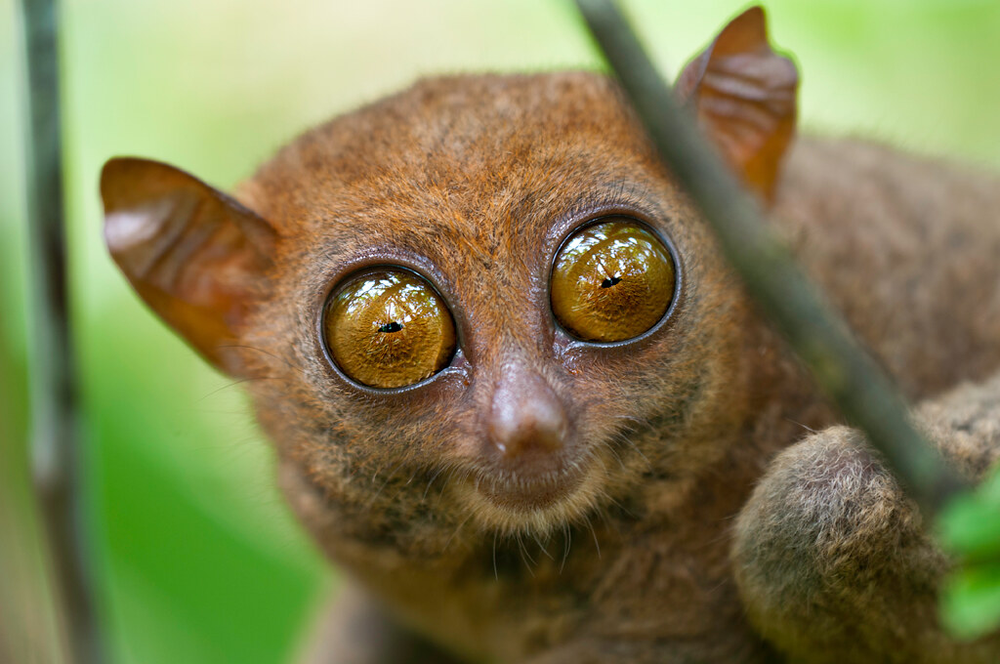{width=30%}
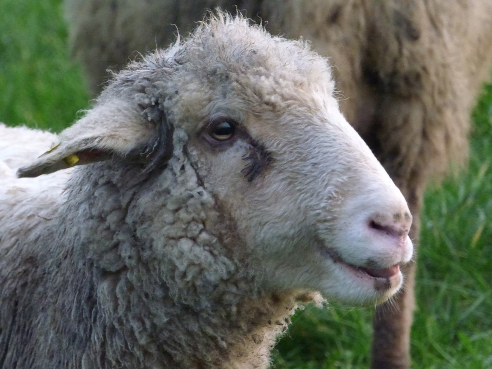{width=30%}
{width=30%}

## Einstufung nach Augen und Zähnen

|Tier|Zahnlänge|Augengröße|
|----|---------|----------|
|Alligator|4 | 1|
|Tiger    |6 | 2|
|Schaf    |2 |2 |
|Pinguin  |0 |4 |

---

# Eintragen in ein Koodinatensystem

* waagrecht Zahnlänge
* senkrecht Augengröße

Zeichne eine mögliche Trenngerade ein.

---

## Diagramm

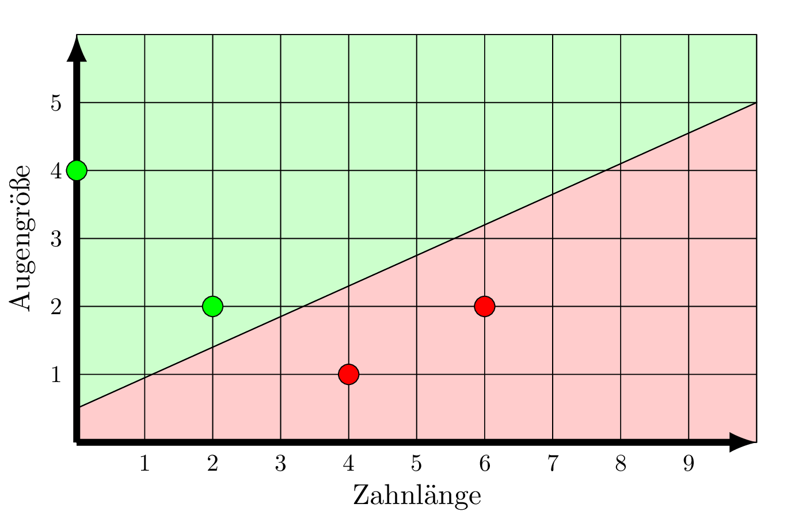

---

## Umsetzung im Perzeptron

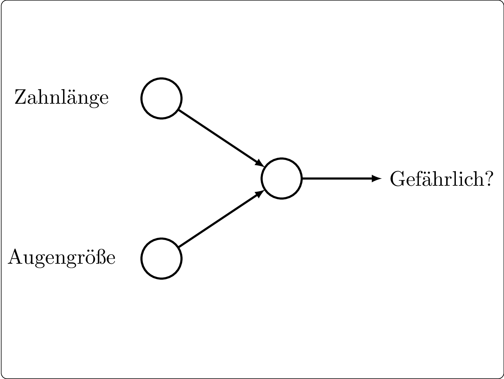


## Versuch 1

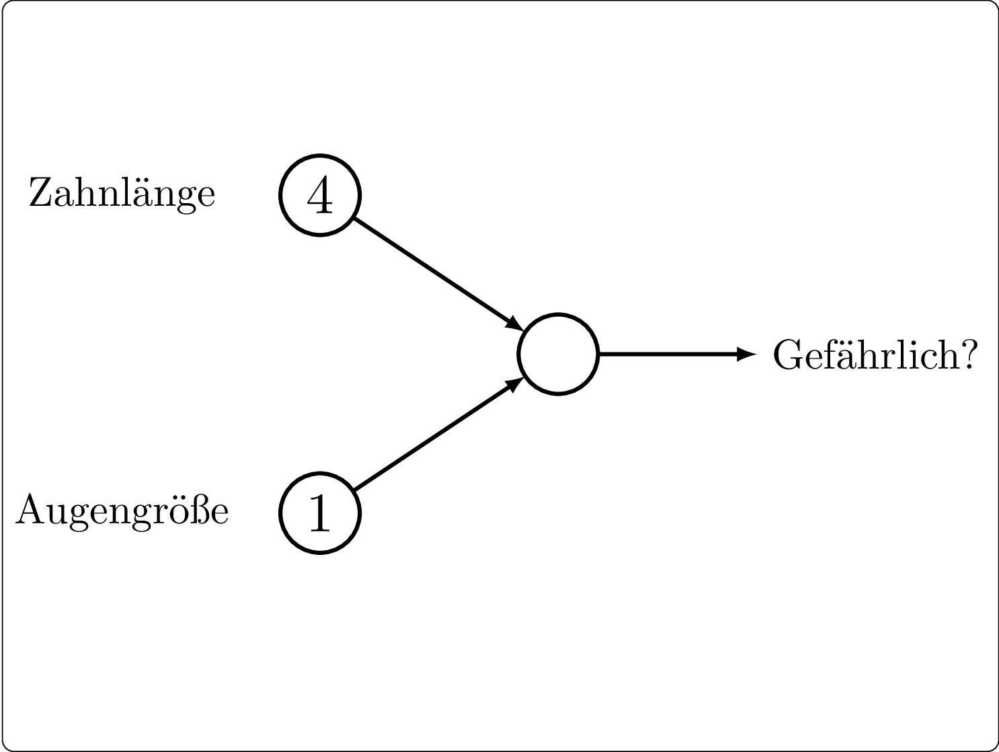

:::{.absolute top="50px" left="80%"}
**Ziel:**  
Ausgabe 1  


**Gewichte:**  
Am Anfang „raten“    


**Schwellenwert:**  
am Anfang „raten“   
:::

## Versuch 1

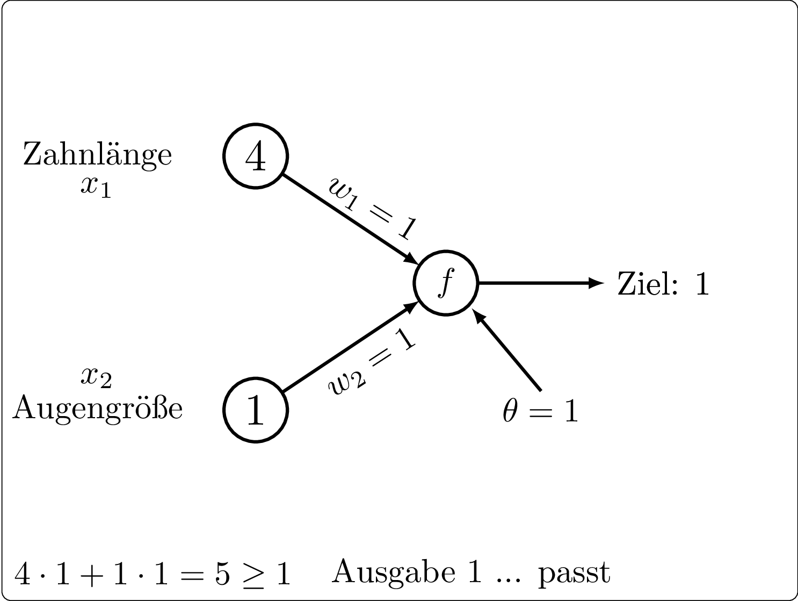

## Versuch 2

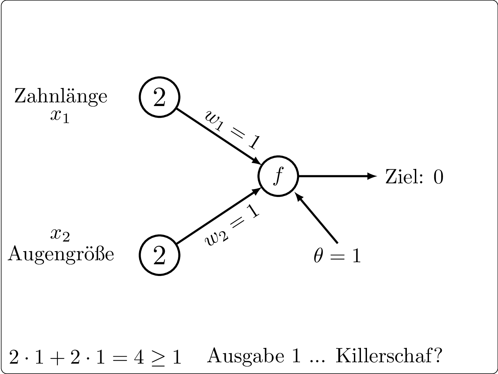

## Das Perzeptron muss lernen!

* Bilde „Richtig - Ausgabe“   
  Beim Schaf: $0 - 1 = -1$
* Wenn „$-1$“:  
  $w_1 = w_1 - x_1$   
  $w_2 = w_2 - x_1$   
  $\theta = \theta +1$ 
* Wenn „+1“: Alle Rechenzeichen umdrehen.
* Nächstes Tier
* ... bis es für alle Tiere stimmt!